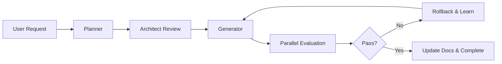

# Harness Engineering: hooliGAN-harness v1.3.0

**Stop guessing if your agent’s code works. Force it to survive the loop.**

Inspired by the adversarial tension of GAN architectures, `hooliGAN-harness` is a high-reliability engineering framework for Claude Code. It replaces fragile "one-shot" generation with a zero-trust pipeline featuring architectural review, parallel security evaluation, confidence-based validation, automatic rollback, cross-session learning, multi-generator collaboration, and enterprise integrations — ensuring enterprise-grade code quality.

---

## 🚀 Quick Installation

### Automatic Installation (Recommended)

```bash
# Clone the repository
git clone https://github.com/aditikilledar/hooligan-harness.git
cd hooligan-harness

# Run the installer (macOS/Linux)
./setup.sh

# Or for Windows
setup.bat
```

The beautiful CLI installer will:
- Auto-detect Claude Code and Codex installations
- Let you choose where to install (Claude, Codex, or both)
- Set up all personas and configurations
- Provide usage instructions

---

## 🧬 The GAN Inspiration

In a Generative Adversarial Network (GAN), a Generator creates data and a Discriminator tries to catch the "fake."

We apply this to software engineering:

1. **The Generator** attempts to satisfy the feature requirements
2. **The Evaluator** assumes the code is buggy until proven otherwise
3. **The Security Evaluator** hunts for vulnerabilities in parallel
4. **The Architect** reviews designs before implementation begins

This competitive loop continues until the output is indistinguishable from senior-level production code.

---

## 🎭 The Five Personas

| Persona | Role | Responsibility |
|---------|------|----------------|
| **Planner** | 📋 Architect | Translates human intent into rigid YAML roadmaps with quantifiable Acceptance Criteria |
| **Architect** | 🏗️ Reviewer | Reviews plans for system-wide impacts and suggests design patterns before coding |
| **Generator** | 💻 Builder | Implements using SOLID principles, defensive programming, and pattern awareness |
| **Evaluator** | 🔍 Gatekeeper | Zero-trust verification with professional disdain for lazy code |
| **Security Evaluator** | 🛡️ Guardian | Parallel OWASP Top 10 scanning and vulnerability detection |

---

## ✨ Key Features

### 🧠 **Intelligence Layer** (v1.1.0)
- **Failure Pattern Memory**: Learns from past failures to prevent recurrence
- **Confidence Scoring**: Adapts validation rigor (0-100% confidence)
- **Pattern Recognition**: Auto-injects tests for known failure patterns

### 🛡️ **Reliability Layer** (v1.2.0)
- **Architectural Review**: Pre-implementation design validation
- **Automatic Rollback**: Snapshots and recovery on critical failures
- **Cross-Session Learning**: Pattern library that evolves over time
- **Incident Reporting**: Detailed failure analysis and prevention

### 🚀 **Scale Layer** (v1.3.0)
- **Multi-Generator Mode**: Frontend, backend, database specialists in parallel
- **Enterprise Integrations**: GitHub Actions, Jenkins, SonarQube, Datadog
- **Living Documentation**: Auto-generated API specs, diagrams, changelogs

---

## 📦 What Gets Installed

```
~/.claude/
├── skills/
│   └── hooliGAN-harness/
│       ├── SKILL.md                    # Main skill definition
│       ├── README.md                   # This file
│       └── .harness/
│           ├── knowledge/              # Failure patterns & confidence scoring
│           ├── evolution/              # Cross-session learning patterns
│           ├── rollback/               # Automatic rollback strategies
│           ├── collaboration/          # Multi-generator configuration
│           ├── integrations/           # External tool configs
│           └── documentation/          # Living docs generation
└── agents/
    ├── harness-planner.md             # Task planning persona
    ├── harness-architect.md           # Design review persona
    ├── harness-generator.md           # Code implementation persona
    ├── harness-evaluator.md           # Functional evaluation persona
    └── harness-security-evaluator.md # Security scanning persona
```

---

## 💻 Usage

Once installed, trigger the harness in your Claude Code or Codex session:

### Basic Usage
```bash
/harness "Add user authentication with JWT"
```

### Complex Features
```bash
/harness "Build a REST API with rate limiting, caching, and OpenAPI documentation"
```

### With Specific Requirements
```bash
/harness "Refactor the payment system to use the Repository pattern with 95% test coverage"
```

---

## 🔄 The Workflow



### Detailed Flow:

1. **Planning Phase**
   - Planner creates YAML roadmap with measurable acceptance criteria
   - Initializes progress tracking in `.harness/progress.md`

2. **Architectural Review**
   - Architect validates design before implementation
   - Identifies patterns from `.harness/evolution/patterns.yaml`
   - Defines rollback strategy

3. **Implementation Phase**
   - Generator creates snapshot for rollback
   - Applies learned patterns and avoids known failures
   - Implements with SOLID, DRY, KISS principles

4. **Parallel Evaluation**
   - Functional Evaluator checks all acceptance criteria
   - Security Evaluator scans for vulnerabilities
   - Both must PASS for task completion

5. **Learning & Documentation**
   - Updates failure patterns and confidence scores
   - Evolves successful patterns for reuse
   - Auto-generates API docs, diagrams, changelogs

---

## ⚙️ Configuration

### Enable Multi-Generator Mode
```yaml
# .harness/collaboration/multi-generator.yaml
multi_generator_configuration:
  enabled: true
  max_parallel_generators: 3
```

### Configure Confidence Levels
```yaml
# .harness/knowledge/confidence-scoring.yaml
confidence_levels:
  exploration: [0, 40]    # High validation
  development: [40, 70]   # Standard validation
  production: [70, 90]    # Streamlined validation
  verified: [90, 100]     # Minimal validation
```

### Set Up Enterprise Integrations
```yaml
# .harness/integrations/external-tools.yaml
integrations:
  ci_cd:
    github_actions:
      enabled: true
  monitoring:
    datadog:
      enabled: true
  security:
    sonarqube:
      enabled: true
```

---

## 📊 Metrics & Learning

The framework tracks:
- **Pattern Effectiveness**: Success rates of discovered patterns
- **Failure Prevention**: Reduction in recurring failures
- **Confidence Evolution**: Improvement in prediction accuracy
- **Collaboration Efficiency**: Multi-generator coordination metrics

---

## 🔧 Advanced Features

### Automatic Rollback Triggers
- Performance regression >20%
- Test coverage drop below 80%
- Security vulnerability detected
- Build failure after 2 attempts

### Pattern Evolution Stages
1. **Experimental** (3+ uses, 60% success)
2. **Proven** (10+ uses, 75% success)  
3. **Standard** (25+ uses, 85% success)
4. **Deprecated** (<50% success after 20 uses)

### Living Documentation Types
- OpenAPI specifications
- Mermaid architecture diagrams
- PlantUML state machines
- Architecture Decision Records (ADRs)
- Automated changelogs

---

## 🤝 Compatibility

- **Claude Code**: Full support with all features
- **Python**: 3.8 or higher required
- **Platforms**: macOS, Linux, Windows

---

## 📚 Documentation

- **[Installation Guide](INSTALL.md)** - Detailed setup instructions
- **[Skill Documentation](SKILL.md)** - Technical skill reference
- **[Architecture](Architecture.jpg)** - Visual system overview

---

## 🏆 Why hooliGAN-harness?

1. **Zero-Trust Verification**: Every line of code is scrutinized
2. **Learning System**: Gets smarter with each use
3. **Enterprise Ready**: Integrates with your existing tools
4. **Parallel Execution**: Multiple specialists work simultaneously
5. **Self-Documenting**: Maintains its own documentation
6. **Failure Recovery**: Automatic rollback keeps you safe
7. **Production Quality**: Code that’s ready to ship

---

## 📈 Version History

- **v1.0.0**: Initial adversarial loop (Planner, Generator, Evaluator)
- **v1.1.0**: Added Security Evaluator, failure memory, confidence scoring
- **v1.2.0**: Added Architect, rollback mechanisms, cross-session learning
- **v1.3.0**: Added multi-generator mode, enterprise integrations, living docs

---

## 🙏 Acknowledgments

Inspired by research from Anthropic, OpenAI, and the broader AI engineering community. Special thanks to the GAN architecture for showing us that adversarial training produces superior results.

---

## 📝 License

MIT License - See [LICENSE](LICENSE) file for details

---

## 🔗 References

* [Anthropic: Effective Harnesses for Long-Running Agents](https://www.anthropic.com/engineering/effective-harnesses-for-long-running-agents)
* [Anthropic: Managed Agents & Multi-Agent Orchestration](https://www.anthropic.com/engineering/managed-agents)
* [Anthropic: Building Effective Agents](https://www.anthropic.com/engineering/building-effective-agents)
* [GitHub Harness Framework Repo by celesteanders](https://github.com/celesteanders/harness)
* [Paper: GAN-inspired Multi-Agent Harnesses](https://medium.com/@gwrx2005/gan-inspired-multi-agent-harnesses-for-long-running-autonomous-software-engineering-architecture-37a8c2d59b6b)
