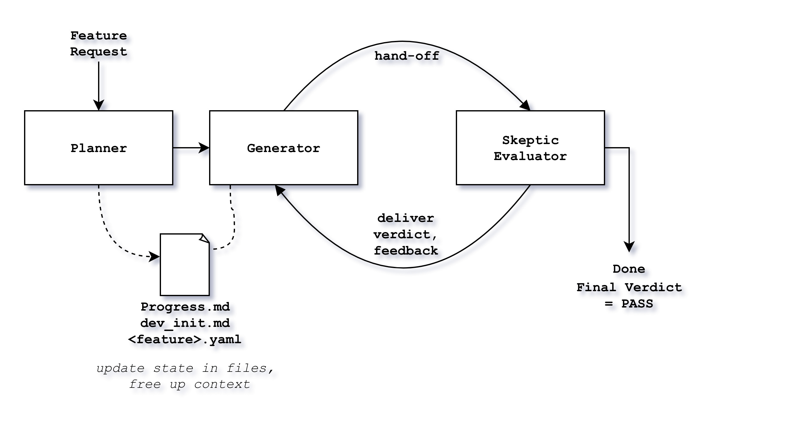

# Harness Engineering: hooliGAN-harness v1.3.0

**Stop guessing if your agent's code works. Force it to survive the loop.**

Inspired by the adversarial tension of GAN architectures, `hooliGAN-harness` is a high-reliability engineering framework for Claude Code. It replaces fragile "one-shot" generation with a zero-trust pipeline featuring architectural review, parallel security evaluation, confidence-based validation, automatic rollback, cross-session learning, multi-generator collaboration, and enterprise integrations — ensuring enterprise-grade code quality.

---

## The GAN Inspiration

In a Generative Adversarial Network (GAN), a Generator creates data and a Discriminator tries to catch the "fake."

We apply this to software:

1. **The Generator** attempts to satisfy the feature requirements.
2. **The Evaluator** (The Adversary) assumes the code is "fake" (buggy, lazy, or breaking standards) until proven otherwise.

This competitive loop continues until the Generator’s output is indistinguishable from high-quality, senior-level production code.

---

## Personas

| Persona             | Role      | Mindset                                                                                          |
| ------------------- | --------- | ------------------------------------------------------------------------------------------------ |
| **Planner**   | Architect | Translates messy human intent into a rigid YAML roadmap with quantifiable Acceptance Criteria.   |
| **Generator** | Builder   | Implements logic using SOLID principles and the "Principle of Least Change" to avoid bloat.      |
| **Evaluator** | Skeptic   | Professional disdain for the output. If a test fails or a `TODO` exists, the task is rejected. |

---

## Installation

To add this skill to **Claude Code**, copy the `harness-skill.md` file into your project or global skill directory.

1. **Clone the repo:**

```bash
git clone https://github.com/aditikilledar/hooligan-harness.git

```

2. **Add to Claude Code:**
   Navigate to the cloned repo, and invoke a Claude session.
   Ask Claude to add SKILL.md and the subagents in /references as a Claude skill.

---

## Example Usage

Once the skill is active, you can trigger the entire adversarial loop with a single prompt.

**Scenario: Implementing a secure API endpoint**

```bash
/harness "Add a POST /login endpoint with bcrypt hashing and JWT generation. Must include rate limiting."

```

**What happens next:**

1. **Planner** creates `.harness/auth-setup.yaml` defining 5 specific tasks and ACs (e.g., "Passwords must not be logged in plaintext").
2. **Generator** writes the code and the tests.
3. **Evaluator** runs the tests. If the Generator forgot to mock the database or left a `console.log`, the Evaluator triggers a **FAIL**.
4. **Loop** repeats until the Evaluator provides a **PASS**.
5. **Exit**: You get a clean PR with a verified `.harness/progress.md` log of the battle.

---

## Workflow

**User Input** → **Planner** → **LOOP** (Generator ↔ Evaluator) **UNTIL ACs PASS** → **Hand-off**



## References

* [Anthropic: Effective Harnesses for Long-Running Agents](https://www.anthropic.com/engineering/effective-harnesses-for-long-running-agents)
* [Anthropic: Managed Agents &amp; Multi-Agent Orchestration](https://www.anthropic.com/engineering/managed-agents)
* [Anthropic: Building Effective Agents](https://www.anthropic.com/engineering/building-effective-agents)
* [Anthropic: Context Engineering for AI Agents](https://www.anthropic.com/engineering/effective-context-engineering-for-ai-agents)
* [Anthropic: SWE-bench (Sonnet Edition)](https://www.anthropic.com/engineering/swe-bench-sonnet)
* [GitHub Harness Framework Repo by celesteanders](https://github.com/celesteanders/harness)
* [OpenAI: Harness Engineering Fundamentals](https://openai.com/index/harness-engineering/)
* [Paper: GAN-inspired Multi-Agent Harnesses](https://medium.com/@gwrx2005/gan-inspired-multi-agent-harnesses-for-long-running-autonomous-software-engineering-architecture-37a8c2d59b6b)
